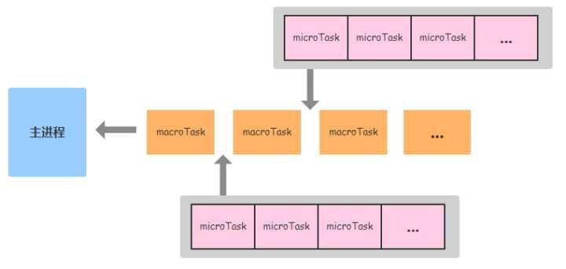

## 变量对象

跟执行上下文相关的一个隐式对象。包含：

- 变量声明（VariableDeclaration）
- 函数声明（FunctionDeclaration）
- 形参

### 全局对象

VO === this === global

在浏览器中，全局对象的 window 属性指向了全局对象，而不是 window 就是全局对象，如下:

```javascript
global = {
  Math: <...>,
  String: <...>
  ...
  ...
  window: global
};
```

> 在全局上，变量声明与未声明的区别在于，声明的变量不能被 delete 删除（eval 中定义的可以删除），而因为未声明被挂载到 global 的变量可以删除。

### 函数上下文中的变量对象

VO === AO

```javascript
AO = {
  arguments: {
    callee: 当前函数的引用,
    length: 实参的个数，
    properties-indexes：
  }
};
```

arguments 对象的 properties-indexes 的值与当前（实际传递的）形参是共享的，修改一个，另一个跟着变，但是未传入的参数不共享。例如函数形参 3 个，实参 2 个，那么 arguments[2]与 z 各是个的值，而 arguments[0]与 x 则共享。

### 处理上下文代码的 2 个阶段

1. 进入执行上下文。依代码顺序在变量对象上填充属性，对于函数声明，直接增加 key 赋值 value，并且重名替换。对于形参与变量声明，增加 key 赋值 undefined，但是重名忽略。
2. 执行代码

## 类型判断

- typeof 操作符： 简单判断类型，无法区分例如数组与对象、null 与对象。
- instanceof 操作符/isPrototypeOf()： 测试实例与原型链中**出现过**的构造函数。
  > 当构造函数返回的是引用类型时，无法判断。
- Object.prototype.toString.call(obj)
- obj.hasOwnProperty(key) 判断 obj 实例有没有 key 属性

## switch

- 用全等比对 switch 传入的表达式值与 case 后面的表达式值，true 就执行 case 下面的代码，false 则找寻 default 代码。
- 一旦代码开始执行（包括 case 的代码或者 default 的代码），如果没有碰到 break，不管后面的 case 条件，一律直接执行。

## `bind`方法

- bind 会产生一个**新方法**，方法名为`bound 原函数名`
- `bind`传递的参数优先级比原函数高，且后来的参数是紧跟着`bind`参数的后面，而不是对位取代
- bind 返回的函数可以通过 new 调用，这时提供的 this 的参数被忽略，指向了 new 生成的全新对象。内部模拟实现了 new 操作符

### 手写 bind

1. 返回`bound`方法
2. 通过`this instanceof bound`来决定是否模拟 new 操作符
3. 调整返回方法的`name`与参数的`length`

## Number

基于 IEEE754 标准的双精度 64 位的浮点数，范围为-(2^53-1)到 2^53-1 结构如下：

- `1` 符号位 sign bit，用来表示正负号
- `11` 指数位 exponent，用来表示次方数
- `52` 尾数 mantissa，用来表示精确度

> 0.1 + 0.2 运算不标准的原因就在于浮点数用二进制表达时是无穷的，最多 53 位就必须截断，所以产生误差。解决办法可利用先放大，后缩小。或者使用 math.js 工具库。

## Object

### 属性种类

- accessor properties 访问器属性，get/set 方法
- data properties 数据属性
- internal properties 内部属性，不可见且无名，例如：[[Prototype]]、[[Extensible]]、[[DefineOwnProperty]]、[[Put]]（赋值运算符=所调用的方法）

### `Object.defineProperty`

定义对象 o 的属性 p，并返回对象 o。

#### 内容

其中 descriptor 分为如下：

- 公共描述符
  - `configurable`(false)能否配置以及被删除（具体影响见下文）
  - `enumerable`(false) 能否枚举
- 择其一
  - data scriptors
    - `value`(undefined)
    - `writable`(false) 该值是否能够被更改（只设置此值只能限制赋值运算符更改，想完全限制需要结合 configurable 属性）
  - accessor descriptors
    - `get`(undefined)
    - `set`(undefined)

#### `configurable`详解

配置为 false 时，即：

1. 不能删除属性 p
2. 不能重新配置属性 p，但有例外：
   1. writable 为 true 时，配置 value
   2. writable 为 true 时，配置 writable
3. 不能数据描述符与访问器描述符之间互转

> 所谓不能重新配置，并不是不能再次调用，只要这次调用的参数值与 configurable 为 false 时设置的一样，依然可以调用。实际上就是一个徒劳的举动。

2.2 的来历：

> There is one exception to this rule—JavaScript allows you to change an unconfigurable property from writable to read-only, for historic reasons; the property length of arrays has always been writable and unconfigurable. Without this exception, you wouldn’t be able to freeze (see Freezing) arrays.

#### 与赋值运算符=的区别

区别：

1. 原对象 o 有属性 p。赋值运算符会被访问器属性中的 setter 和数据属性中的 writable:false 控制，就此结束。而定义是根据一定的规则重新配置原属性。
2. 原对象 o 的原型有属性 p。如果将要操作的属性 p 是来自于原型，那么赋值会被 setter 和 writable 影响，而定义不会（就算原型的 p 属性被设置为 configurable:false, writable:false 也不会）。
3. 原对象 o 无属性 p。执行新增操作，赋值运算符虽然是调用[[Put]]进行操作，但是最后两者都会殊途同归调用[[DefineOwnProperty]]，区别在于默认值的设置。前者全为 true，后者全为 false。

共同：

1. 创建新的值时都会检测对象 o 是否是非扩展对象。
   > 扩展对象，检查用 Object.isExtensible()，设置用 Object.preventExtensions()，注意与冻结的区别。

### `Object.is`

与`===`区别：

- `+0` 与 `-0`，`===`返回 true，Object.is 返回 false
- `NaN`与`NaN`，`===`返回 false，Object.is 返回 true

### 对象循环

#### for in

含继承，不含 symbol 属性，可枚举属性

#### Object.keys()

不含继承，不含 symbol 属性，可枚举属性

#### Object.getOwnPropertyNames()

含继承，不含 symbol 属性， 可枚举与不可枚举属性

#### Reflect.ownKeys()

以上  所有

以上的几种方法遍历对象的键名，都遵守同样的属性遍历的次序规则。

- 首先遍历所有数值键，按照数值升序排列。
- 其次遍历所有字符串键，按照加入时间升序排列。
- 最后遍历所有 Symbol 键，按照加入时间升序排列。

## Class

### 定义

es6 的 class 关键词与 es5 构造函数的定义区别，注意次序

- 实例属性
  - 1. 使用=的属性和属性方法，在构造函数中生成，this 永久指向实例
  - 2. 不使用=的属性，在构造函数中生成
  - 3. 不使用=的属性方法，在类生成中生成，加入到类的原型上（多实例公用），this 指向随动
- 类属性
  - 4. 不使用等于=，在类生成中生成，this 指向随动
  - 5. 使用=的属性和属性方法，在类生成后才加上去，且 this 永久指向类本身

```javascript
class Cat {
  constructor(name) {
    this.name = name;
  }

  fn = () => {
    console.log(this);
  };
  name = 3;

  fn() {
    console.log(this);
  }

  static s = 1;
  static sfn() {}
  static sfn = () => {
    console.log(this);
  };
}
```

转化后

```javascript
var Cat = (function() {
  function Cat(name) {
    var _this = this;

    this.fn = function() {
      console.log(_this);
    };

    this.name = 3;
    this.name = name;
  }

  Object.defineProperties(Cat.prototype, {
    fn: function() {
      console.log(this);
    }
  });

  Object.defineProperties(Cat, {
    sfn: function() {
      console.log(this);
    }
  });

  return Cat;
})();

Cat.s = 1;

Cat.sfn = function() {
  console.log(Cat);
};
```

### 继承

最好的继承的特点：

- 能给超类构造函数传参
- 拥有共享方法
- constructor 能正确指向

#### 原型链继承

```javascript
function SubType() {}
SubType.prototype = new SuperType();
```

#### 借用构造函数继承（constructor stealing）

```javascript
function SubType() {
  SuperType.call(this);
}
```

#### 组合继承（conbination inheritance）

结合原型链继承与借用构造函数继承。

#### 原型式继承（prototypal inheritance）

即 es5 的 Object.create()方法。需要一个基础对象，来创建另一个类似的对象。

```javascript
function object(o) {
  function F() {}
  F.prototype = o;
  return new F();
}
```

#### 寄生式继承（parasitic inheritance）

创建一个仅用于封装继承过程的函数，该函数在内部以某种方式来增强对象。

```javascript
function createAnother(original) {
  var clone = object(original);
  clone.sayHi = function() {
    alert("hi");
  };
  return clone;
}
```

#### 寄生组合式继承

通过借用构造函数来继承属性，使用寄生式继承来继承超类的原型。

```javascript
SubType.prototype = object(SuperType.prototype);
SubType.prototype.constructor = SubType;
```

> 类的静态属性继承：`Object.setPrototypeOf(SubType, SuperType)`

### 原型
要产生一个变量v，需要：
1. 能设置v的自有属性（要是能按一定逻辑设置就更好了）
2. 能设置v的公有属性

js用了以下东西来操作：
1. 用一个函数f来设置自有属性，函数拥有逻辑，更贴切
2. 一个对象p，包含所有类v变量的公有属性

为了更加紧密、规范：
1. 函数采用大写命名F，别名构造函数
2. 函数天生拥有一个属性`prototype`，来存储对象p

所以任何一个变量v就可以由一个构造函数F生成。

生成后的v怎么与构造函数关联呢。

想当然的是v的一个属性指向构造函数F，问题有两：
- 该关联属性应该有所隐藏，不能算作v表现的东西
- 找寻公有属性，需要多取一次值，需要F.prototype，一次到没什么，当层级多了以后，这是一种不必要的浪费

js采用了以下设置：
1. 变量v拥有一个隐式原型`__proto__`
2. `__proto__`直接指向公有属性p，而不是构造函数F，而出于又要能与构造函数F关联，所以把F存在了公有属性p的属性`constructor`中

至此，一切关联都理所当然。

#### 解决Function
构造函数F又是谁生成的呢？按照推论到底，是Function函数，那么Function函数又是由哪个构造函数生成的呢。

函数Function自己创造了自己，这条规则却不适用于Object.prototype

- ✅`Function.__proto__.constructor === Function`
- ✅`Function.__proto__ === Function.prototype`
- ❌`Object.prototype.__proto__ === Object.prototype`

#### 解决Object.prorotype
公有属性p，也就是原型prototype推论到底，是由Object构造函数生成的，Object在上述第一个问题中产生，可是Object.prototype又是怎么产生的。

null不借构造函数就创造了Object.prototype，即：

- ✅`Object.prototype.__proto__ === null`

那么自然Object.prototype的构造函数也没有。


### new

1. 创建空对象
2. 链接原型链
3. 执行构造函数
4. 根据步骤 3 的结果类型返回不同的值

```javascript
var _new = function() {
  var Constructor = [].shift.call(arguments);
  if (typeof Constructor !== "function") {
    throw new Error("请传入正确的构造函数");
  }
  var instance = Object.create(Constructor.prototype);
  var ret = Constructor.apply(instance, arguments);
  return ret instanceof Object ? ret : instance;
};
```

## 异步编程

### Promise

promise 的 then，如果在执行 promise 后，该 promise 为 resolved 状态，那么 then 会被马上进入微任务队列。

#### Promise.resolve()

灵活运用转 Promise 对象的接口 Promise.resolve()。

参数处理情况如下：

- Promise 对象，直接返回。
- thenable 对象，该对象 then 方法里必须使用 resolve 或者 reject，否则 Promise.resolve(thenable 对象)一直是 pending 状态

```javascript
const obj = {
  then: () => {}
};

Promise.resolve(obj);
// 等价于
new Promise(obj.then);
```

- 其他值。

```javascript
const obj = {};
Promise.resolve(obj);
// 等价于
new Promise(resolve => resolve(obj));
```

- 不传值。等价于 Promise(undefined)

#### 利用`runner`函数进行带逻辑的异步请求

```javascript
function runner(_gen) {
  return new Promise((resolve, reject) => {
    var gen = _gen();

    _next();
    function _next(_last_res) {
      var res = gen.next(_last_res);

      if (!res.done) {
        var obj = res.value;

        if (obj.then) {
          obj.then(
            res => {
              _next(res);
            },
            err => {
              reject(err);
            }
          );
        } else if (typeof obj == "function") {
          if (
            obj.constructor
              .toString()
              .startsWith("function GeneratorFunction()")
          ) {
            runner(obj).then(res => _next(res), reject);
          } else {
            _next(obj());
          }
        } else {
          _next(obj);
        }
      } else {
        resolve(res.value);
      }
    }
  });
}

runner(function*() {
  let userData = yield $.ajax({ url: "getUserData", dataType: "json" });

  if (userData.type == "VIP") {
    let items = yield $.ajax({ url: "getVIPItems", dataType: "json" });
  } else {
    let items = yield $.ajax({ url: "getItems", dataType: "json" });
  }

  //生成、...
});
```

> 与`async/await`区别
>
> - 写法一样，还不需要`runner`函数
> - 还可以写成箭头函数。

### Generator 函数

- 一个状态机，内部封装了很多种状态。
- 此函数会返回一个遍历器对象

可用结构操作符`...`遍历。

```javascript
function* initializer(count, mapFunc = i => i) {
  for (let i = 0; i < count; i++) {
    const value = mapFunc(i, count);
    if (mapFunc.constructor.name === "GeneratorFunction") {
      yield* value;
    } else {
      yield value;
    }
  }
}

// 用于生成52张扑克牌
const cards = [
  ...initializer(13, function*(i) {
    let p = i + 1;
    if (p === 1) {
      p = "A";
    }
    if (p === 11) {
      p = "J";
    }
    if (p === 12) {
      p = "Q";
    }
    if (p === 13) {
      p = "K";
    }
    yield `♠${p}`;
    yield `♣️${p}`;
    yield `♥️${p}`;
    yield `♦️${p}`;
  })
];
```

### async/await

```javascaript
// 注意区分
const a = yield 3; // a: undefined
const b = await 3; // b: 3
```

## `Iterator`

默认的 Iterator 接口部署在数据结构的 Symbol.iterator 属性上。换言之，只要一个数据实现了这个属性，他就可以使用 for...of 进行遍历。此属性值必须为一个**遍历器对象**（含有 next 方法的对象）。

```javascript
let flag = false;
const obj = {
  [Symbol.iterator]() {
    return {
      next() {
        if (flag) {
          return {
            value: 3,
            done: true
          };
        } else {
          flag = true;
          return {
            value: 3,
            done: false
          };
        }
      }
    };
  }
};
for (let k of obj) {
  console.log(k);
}
// 3
```

## 正则表达式

正则要么匹配字符，要么匹配位置。

### 提示要点

- 字符集`[]`中的特殊字符无需转义符`/`
- `\1` `\2`代表括号匹配结果，宿主环境不一定是这个，例如 js 环境中是`$1`

### 位置

`\b` `\B` `^` `$` `(?=p)` 都表示位置，位置都不参与实际匹配结果。

#### `(?=p)`：

表示 p 前面的位置。反义是`(?!p)`。反向是`(?<=p)`，表示 p 后面的位置。反义是`(?<!p)`。

p 本身并不是匹配结果，它只是匹配的条件。例如你要匹配的字符是 xxx。只能使用如下几种组合方式：
`xxx(?=p)` positive lookahead
`xxx(?!p)` negative lookahead
`(?<=p)xxx` positive lookbehind
`(?<!p)xxx` negative lookbehind

### 贪婪模式

默认匹配是贪婪匹配，可以在量词`*`或者`{m,n}`后面加上`?`符号，使其惰性匹配。

### 分组

匹配下面一个字符

- 在代码里是字符串模式
- 里面有双斜杠`//`

那么规则为

```
/(?<!\\)('|"|`).*?\/\/.*?(?<!\\)\1/mg
```

### 字符集

-

### 计算匹配结果

match、exec、test 方法

## 浏览器进程

浏览器内核，一个 tab 页，代表一个进程，它又拥有多个线程

- GUI 渲染线程
- js 引擎线程
- 事件触发线程（ok 后放入 js 引擎的执行队列）
- 定时触发线程（ok 后通知事件触发线程）
- 异步 HTTP 请求线程（ok 后通知事件触发线程）

### 事件流

捕获 -> 本体 -> 冒泡，其中`dom.onclick = function () {}`为冒泡阶段，`addEventListener`根据 useCapture 参数来定（默认 false，即冒泡阶段），但是本体不区分捕获或者冒泡，按照事件定义顺序执行。

### 事件循环 event loop

- 主进程（即整体代码）属于`macrotasks`（`tasks`）。待执行完毕才会去寻找`microtask` (主动使用`.click()`触发事件，不属于异步！此时并没结束主进程，所以如果有事件冒泡，这时会先冒完，而且此时`MutationObserver`处于`pending`状态，无法多次实现)
- `js`通过事件循环（`event loop`）机制来定期访问异步任务队列
- `macroTasks`的任务，一次循环只处理一次（比如嵌套`setTimeout`)，而`microtask`队列能处理多次（比如`Promise`的`then`回调）



**macro-task**

- 整体代码
- `setTimeout`
- `setInterval`
- `setImmediate` (存在于`node`, 在`v.9.11.1`环境下测试，慢于 `setTimeout(fn, 0)`)
- `requestAnamationFrame`
- `I/O`
- `UI渲染`

**microtask**

- `Promise`
- `process.nextTick`
- `Object.observe`
- `MutationObserver`

### `ajax`

#### 原生写法

```javascript
if (window.XMLHttpRequest) {　 // Mozilla, Safari...
  xhr = new XMLHttpRequest();
} else if (window.ActiveXObject) { // IE
  try {
    xhr = new ActiveXObject('Msxml2.XMLHTTP');
  } catch (e) {
    try {
      xhr = new ActiveXObject('Microsoft.XMLHTTP');
    } catch (e) { }
  }
}
if (xhr) {
  xhr.onreadystatechange = onReadyStateChange;
  xhr.open('get', 'http://localhost:3000/user', true);
  // 设置 Content-Type 为 application/x-www-form-urlencoded
  // 以表单的形式传递数据
  xhr.setRequestHeader('Content-Type', 'application/x-www-form-urlencoded');
  xhr.send('username=admin&password=root');
}

// onreadystatechange 方法
function onReadyStateChange() {
  // 该函数会被调用四次
  console.log(xhr.readyState);
  if (xhr.readyState === 4) {
    // everything is good, the response is received
    if (xhr.status === 200) {
      console.log(JSON.parse(xhr.responseText);
    } else {
      console.log('There was a problem with the request.');
    }
  } else {
    // still not ready
    console.log('still not ready...');
  }
}
```

#### `fetch`

基于 Promise 设计，基础用法如下。

```javascript
fetch(url, {
  method: 'post',
  body: JSON.stringify({
    a: 1,
    b: 2
  }),
  // body: 'a=1&b=2',
  headers: {
    'Content-Type': 'application/json'
    // 'Content-Type': 'application/x-www-form-urlencoded;charset=utf-8'
  },
  // 是否带cookie
  // same-origin: 同源带 include: 始终带 omit: 不带
  credentials: 'omit' //默认
})
  .then(
    response => {
      // 在这里进行中间件操作，封装
      if (response.ok) {
        return response.json()
      } else {
        // throw new Error('fetch done. but something is wrong!')
        return Promise.reject({
          status: response.status,
          statusText: response.statusText
        })
      }
    },
    error => {
      // 请求本身没成功，比如url地址错误
      console.log('fetch is error', error) })
    }
  )
  .then(data => {
    // 处理最终结果
  })
  .catch(error => {
    // 中间件捕获的错误
  })
```

 有几个坑

- `cookie` 传递
- `404`、`503` 等错误不被认为是网络错误，是不会抛错的。在中间件里用 `reponse.ok` 与 `response.status` 来确定处理

### 冒泡排序

#### 基础写法

```javascript
const bubbleSortByASC = arr => {
  for (let i = 0; i < arr.length; i++) {
    for (let j = 0; j < arr.length - i - 1; j++) {
      if (arr[j] > arr[j + 1]) [arr[j], arr[j + 1]] = [arr[j + 1], arr[j]];
    }
  }
};
```

#### 优化 1：外层轮回次数优化

当一轮没进行任何交换时，已是有序状态，不再轮回排序

```javascript
const bubbleSortByASC = arr => {
  for (let i = 0; i < arr.length; i++) {
    let isSorted = true;
    for (let j = 0; j < arr.length - i - 1; j++) {
      if (arr[j] > arr[j + 1]) {
        [arr[j], arr[j + 1]] = [arr[j + 1], arr[j]];
        isSorted = false;
      }
    }
    if (isSorted) {
      break;
    }
  }
};
```

#### 优化 2：找出有序边界

每轮回一次，尽量缩小无序数组的范围

```javascript
const bubbleSortByASC = arr => {
  // 上次交换位置
  let lastExchangeIndex = 0;
  // 无序数组边界，即在这个范围内进行两两比较
  let sortBorder = arr.length - 1;

  for (let i = 0; i < arr.length; i++) {
    let isSorted = true;
    for (let j = 0; j < sortBorder; j++) {
      if (arr[j] > arr[j + 1]) {
        [arr[j], arr[j + 1]] = [arr[j + 1], arr[j]];
        // 设false，说明这一轮进行了交换，是无序的
        isSorted = false;
        // 每次更新交换位置
        lastExchangeIndex = j;
      }
    }
    // 这一轮的最后交换位置即为有序数组与无序数组的分界
    // lastExchangeIndex属于无序数组
    sortBorder = lastExchangeIndex;
    // 这一轮没进行任何交换，即已是有序数组，跳出，不再轮回
    if (isSorted) {
      break;
    }
  }
};
```

#### 一直认为的错误版本（虽然也能排序）

```javascript
const sort = arr => {
  for (let i = 0; i < arr.length; i++) {
    for (let j = i + 1; j < arr.length; j++) {
      if (arr[i] < arr[j]) {
        [arr[i], arr[j]] = [arr[j], arr[i]];
      }
    }
  }
};
```

### 连等赋值

一道”面试“题

```javascript
var a = { n: 1 };
a.x = a = { n: 2 };
console.log(a.x); // ???
```

- 连等赋值会提前保存对象的引用，复制时右边取新的，左边取提前保存的。
- A=B=C 的调用过程其实是 B=C，再执行 A=B，注意 C 值只调用一次（可用 getter 进行测试）

所以上述答案为`undefined`

## Array

### Array.prototype.map

内部原理：

- 提前预知并确定循环长度
- 执行时
  - 元素为 empty，不进行方法调用，并在返回值中设为 empty
  - 元素不为 empty，获取此刻原数组的元素值，执行方法调用

> 使用 map 方法处理数组时，数组元素的范围是在 callback 方法第一次调用之前就已经确定了。在 map 方法执行的过程中：原数组中新增加的元素将不会被 callback 访问到；若已经存在的元素被改变或删除了，则它们的传递到 callback 的值是 map 方法遍历到它们的那一时刻的值；而被删除的元素将不会被访问到。 —— MDN https://developer.mozilla.org/zh-CN/docs/Web/JavaScript/Reference/Global_Objects/Array/map

> 边循环边更改原数组时，有两个特点。一是循环长度只减不增，二是循环值为更改后原数组按 index 取值。

### Array.prototype.reduce

传入函数的 a，b 值并不是数组的每一项，准确的讲，分别为累加器与当前项，有 2 种情况：

- 设定了初始值，第 1 次循环，累加器值为初始值
- 未设定初始值，第 1 次循环，累加器值为第 1 项，且从数组第 2 项开始循环

综上，应避免以下错误：

```javascript
// ❌ 报错
const arr = []; //一定要确定数组不为空
arr.reduce((a, b) => a + b);

// ❌ 结果为NaN
const arr = [{ price: 1 }, { price: 2 }];
arr.reduce((a, b) => a.price + b.price, 0);
```

### empty

使用`delete arr[i]`，原数组的下标并不会改变，而是在原来的下边出，把值设为 empty，此值有一定的特殊性。

```javascript
const arr = [1, 2, 3, 4, 5];
arr[1] = undefined;
delete arr[3];
console.log("changed : ", arr);

// for (不跳过任意)
for (let i = 0; i < arr.length; i++) {
  console.log(`for ${arr[i]}`);
}

// map（跳过empty，返回结果包含empty）
const mapedArr = arr.map(v => {
  console.log(`map ${v}`);
  return "hello";
});
console.log(`mapedArr ${mapedArr}`, mapedArr);
// filter（跳过empty，返回结果不包含empty）
arr.forEach(v => console.log(`forEach ${v}`));
const filteredArr = arr.filter(v => {
  console.log(`filter ${v}`);
  return true;
});
console.log(`filteredArr ${filteredArr}`, filteredArr);
```

### async/await

注意 for 循环（循环之间会等待）与 forEach（不会等待）调用的不同。

### 稀疏与密集数组

稀疏数组即非连续性数组，里面有空元素，这在使用数组方法（map,forEach 等）时不会遍历该元素。

快速创建密集数组：

```javascript
//
const arr = Array.apply(null, Array(3));
// [undefined, undefined, undefined]

// 扩展应用
const arr = Array.apply(null, Array(5));

arr.map(Function.prototype.call.bind(Number));
arr.map(Function.prototype.call, Number);
// 等同于下面
arr.map((v, i, array) => {
  return Number.call(v, i, array);
});
// [1, 2, 3, 4, 5]
// ？？？为什么这样不行，arr.map(Number.call)
```

## 数据转换为规则

### ToPrimitive

#### string

调用 toString 方法：

- 原始值，强转 string 后的原始值
- 非原始值，调用 valueOf 方法
  - 原始值，强转 string 后的原始值
  - 非原始值，抛出异常`TypeError: Cannot convert object to primitive value`

#### number

调用 valueOf 方法：

- 原始值，return 强转 number 后的原始值
- 非原始值，调用 toString 方法 - 原始值，return 强转 number 后的原始值 - 非原始值，抛出异常`TypeError: Cannot convert object to primitive value`
  > 强转 number 规则，null -> 0，undefined -> NaN，true -> 1，false -> 0，失败 -> NaN

## 递归

纯粹的函数式编程语言没有循环操作命令，所有的循环都用递归实现。

递归就是函数自己调用自己。

### 尾调用

函数最后一步调用一个函数，只调用函数，不做其它运算。

### 尾递归

函数最后一步调用自身。

例如：一个阶乘函数，n 够大时发生栈溢出。

```javascript
function factorial(n) {
  if (n === 1) return 1;
  return n * factorial(n - 1);
}
```

改写成尾递归，由于每次执行完后不需要保持当前作用域的变量，所以可销毁，永远只有一层（V8 引擎未实现）。

```javascript
function factorial(n, total) {
  if (n === 1) return total;
  return factorial(n - 1, n * total);
}
```

对于不支持自动优化的，改写为迭代模式。

```javascript
const factorial = v => {
  let initialValue = v;
  let result = 1;
  while (initialValue > 0) {
    result = initialValue * result;
    initialValue--;
  }
  return result;
};
```

## 内存管理

### GC（Garbage Collection）

- 引用计数（reference counting）。缺点：无法解决循环引用。
- 标记清除（mark and sweep algorithm）

### 常见内存泄漏

- 全局变量。不声明变量或者全局作用域函数中调用 this，不小心把变量挂载到全局对象上，此变量一直被全局对象引用，只有关闭窗口或者重新刷新页面才被释放。
- console.log。传入的对象会被一直引用，不会被 GC 回收。
- 闭包。首先闭包本身带作用域，所以占用内存会比一般的多。然后在使用时，很多不明显的变量会被缓存，例如:

```javascript
function f() {
  var str = Array(10000).join("#");
  var foo = {
    name: "foo"
  };
  const unused = () => {
    var message = "it is only a test message";
    str = "unused: " + str;
  };
  function getData() {
    return "data";
  }
  return getData;
}
var list = [];
document.querySelector("#btn").addEventListener(
  "click",
  function() {
    list.push(f());
  },
  false
);
// str变量虽然没使用，但一直被缓存。
```

解释如下：在相同作用域内创建的多个内部函数对象是共享同一个变量对象 AO。如果创建的内部函数没有被其他对象引用，不管内部函数是否引用外部函数的变量和函数，在外部函数执行完，对应变量对象便会被销毁。反之，如果内部函数中存在有对外部函数变量或函数的访问（可以不是被引用的内部函数），并且存在某个或多个内部函数被其他对象引用，那么就会形成闭包，外部函数的变量对象就会存在于闭包函数的作用域链中。这样确保了闭包函数有权访问外部函数的所有变量和函数。

个人理解：内部函数没有被引用，那么所有变量执行完后就销毁。如果有一个内部函数被其他地方引用，那么大家（所有内部函数）引用的东西都得存在闭包里面，就算你没有被其他地方引用也得存下来。

另一个闭包泄露例子：

```javascript
var theThing = null;
var replaceThing = function() {
  var originalThing = theThing;
  var unused = function() {
    if (originalThing) console.log("hi");
  };
  theThing = {
    longStr: new Array(1000000).join("*"),
    someMethod: function() {
      console.log(someMessage);
    }
  };
};
setInterval(replaceThing, 1000);
```

- DOM。dom 赋值给变量，dom 销毁后，变量依然保持引用，造成 dom 没有被真正销毁。
- timers。一般是 setInterval 用完没有被及时 clear 以及 setTimeout 嵌套没有被正确终止。
- EventListener。一般是某个重复事件中绑定其他 dom 事件，当事件重复执行时，造成了重复绑定，导致异常。
  > dom.addEventListener('click', fn, false)这种方式多次执行绑定不会增加新事件。

## 严格模式

包括但不限于以下特点：

- 全局对象为 undefined。这样就不会因为未声明变量而挂载到全局对象上，从而造成内存泄漏，因为一旦挂载了，那么只有刷新页面或者关闭 tab 才会被释放。
- arguments 不可用。据阮一峰文章解释，这样就可以优化尾递归，因为非严格模式拥有 arguments.callee，需指向本身，造成了作用域栈不能被优化。（测试未通过）

## JSON.stringify

### 第 2 个参数

只针对对象有作用

#### 数组

只转换数组内的 key 值，无则转换为`{}`。

#### 函数

针对每一次的返回进行处理。比如可以转换`{ a: new Set([1]) }`

### 第 3 个参数

只针对对象有作用，用于美化对象的输出。

#### 数字

0 就是默认，比 0 小无效。每一行前面加相应数目的空格。

#### 字符串

每一行前面加相应的字符。
